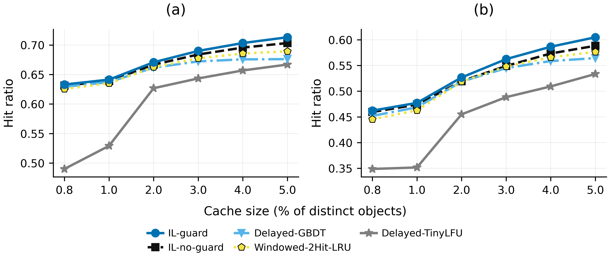
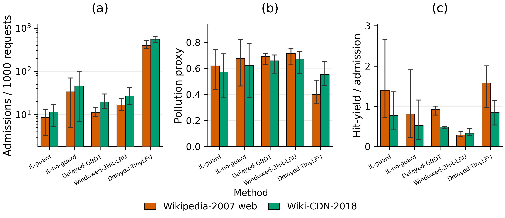
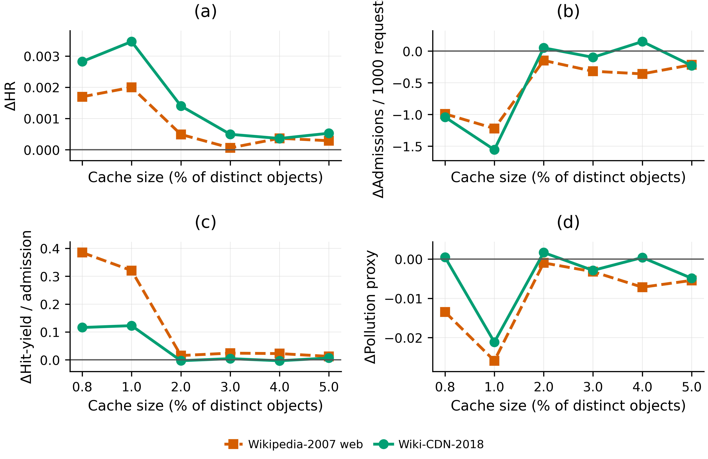
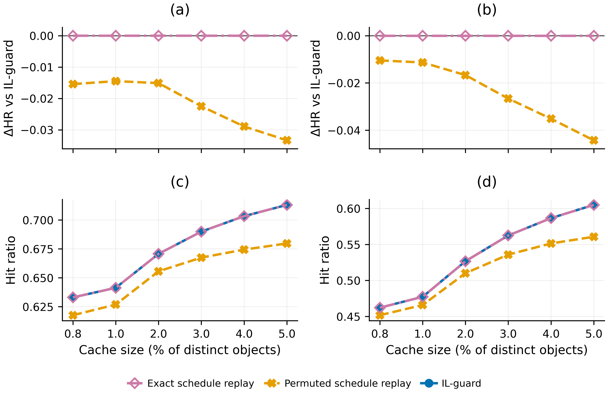
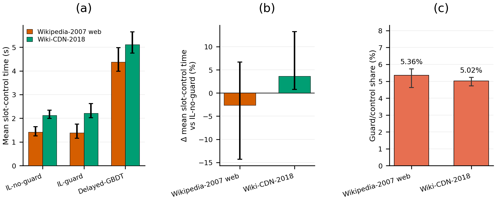

# Edge IL Cache Experiments

This repository contains code for IL-based edge caching experiments
(guard/no-guard variants), overhead measurement, and analysis notebooks.

## 1. Project Setup

Create the Conda environment from `environment.yml`:

```bash
conda env create -f environment.yml
```

Activate the environment:

```bash
conda activate edge_il_cache
```

## 2. Dataset Preparation

Important: the experiment scripts expect datasets under `data/raw/...` (not
`data/row/...`).

Create dataset folders:

```bash
mkdir -p data/raw/wikipedia_september_2007
mkdir -p data/raw/wiki2018
```

Download datasets:

```bash
# Wikipedia September 2007
curl -L "http://www.globule.org/wiki/2007-09/wiki.1190153705.gz" \
  -o data/raw/wikipedia_september_2007/wiki.1190153705.gz

# Wiki2018 CDN trace (tar.gz)
curl -L "http://lrb.cs.princeton.edu/wiki2018.tr.tar.gz" \
  -o data/raw/wiki2018/wiki2018.tr.tar.gz
```

Convert `wiki2018.tr.tar.gz` to `wiki2018.gz` (10M prefix) using the provided
script:

```bash
python scripts/convert_wiki2018.py
```

This script writes:

- `data/raw/wiki2018/wiki2018.gz`

The common datasets supported by the main paper commands below are:

- `wikipedia_september_2007`
- `wiki2018`

## 3. Run Main Experiments

### 3.1 No Guard

```bash
for ds in wikipedia_september_2007 wiki2018; do
  python3 src/experiments/run_il_cache_guard_ablation.py \
    --variant no-guard \
    --dataset "$ds" \
    --feature-set A2 \
    --base-learner nb \
    --all-sizes \
    --results-root results \
    --disable-progress
done
```

### 3.2 Guard / Full Guardrails

```bash
for ds in wikipedia_september_2007 wiki2018; do
  python3 src/experiments/run_il_cache_guard_ablation.py \
    --variant full \
    --dataset "$ds" \
    --feature-set A2 \
    --base-learner nb \
    --all-sizes \
    --results-root results \
    --disable-progress
done
```

### 3.3 Delayed-TinyLFU

```bash
for ds in wikipedia_september_2007 wiki2018; do
  python3 src/experiments/run_baseline_cache.py \
    --dataset "$ds" \
    --policy TINYLFU \
    --results-root results \
    --disable-progress
done
```

### 3.4 Delayed-GBDT

```bash
for ds in wikipedia_september_2007 wiki2018; do
  python3 src/experiments/run_gbdt_cache_delayed_standard.py \
    --dataset "$ds" \
    --feature-set A2 \
    --results-root results/gbdt_delayed_standard \
    --prediction-mode batch \
    --disable-progress
done
```

### 3.5 Windowed-2Hit-LRU

```bash
for ds in wikipedia_september_2007 wiki2018; do
  python3 src/experiments/run_windowed_2hit_lru.py \
    --dataset "$ds" \
    --all-sizes \
    --window-slots 1 \
    --results-root results/windowed_2hit_lru \
    --disable-progress
done
```

## 4. Run Overhead Experiments

Use the orchestration script to run the three overhead models across both
datasets with repeated measurements:

```bash
scripts/run_overhead_benchmark.sh \
  --repeats 5 \
  --dataset all \
  --policy all \
  --capacity-percent 0.8 \
  --impl-mode optimized \
  --gbdt-prediction-mode batch \
  --results-root results/overhead_benchmark
```

Equivalent per-model commands are listed below.

### 4.1 No-Guard Overhead

```bash
for ds in wikipedia_september_2007 wiki2018; do
  python3 src/experiments/run_il_cache_overhead_no_guard.py \
    --dataset "$ds" \
    --feature-set A2 \
    --base-learner nb \
    --capacity-percent 0.8 \
    --results-root results/overhead_benchmark \
    --disable-progress \
    --benchmark-mode \
    --impl-mode optimized
done
```

### 4.2 Guard Overhead

```bash
for ds in wikipedia_september_2007 wiki2018; do
  python3 src/experiments/run_il_cache_overhead_guard.py \
    --dataset "$ds" \
    --feature-set A2 \
    --base-learner nb \
    --capacity-percent 0.8 \
    --results-root results/overhead_benchmark \
    --disable-progress \
    --benchmark-mode \
    --impl-mode optimized \
    --guard-config v2-cap020
done
```

### 4.3 Delayed-GBDT Overhead

```bash
for ds in wikipedia_september_2007 wiki2018; do
  python3 src/experiments/run_gbdt_cache_overhead.py \
    --dataset "$ds" \
    --feature-set A2 \
    --capacity-percent 0.8 \
    --results-root results/overhead_benchmark \
    --disable-progress \
    --benchmark-mode \
    --prediction-mode batch
done
```

## 5. Paper Figures And Tables

The paper uses the following outputs after the main experiment and overhead
commands. Figure and table numbers below follow the paper numbering, not the
internal v5 artifact numbering. To render the figures on GitHub, keep the
listed PNG files available in the repository or publish them as release
artifacts and update the links accordingly.

### Figure 3



**Figure 3.** System-level hit-ratio comparison under post-warm-up
trace-driven replay. IL-guard is compared with IL-no-guard, Delayed-GBDT,
Windowed-2Hit-LRU, and Delayed-TinyLFU on (a) Wikipedia-2007 web and (b)
Wiki-CDN-2018 using the same cache-size sweep, fixed LRU eviction, and
one-slot delayed-apply protocol.

Source files:

- `results/guardrails_signal_v2_cap020_paper_artifacts_v5_paper_order/figures/Fig3_system_hit_ratio_comparison_paper.pdf`
- `results/guardrails_signal_v2_cap020_paper_artifacts_v5_paper_order/figures/Fig3_system_hit_ratio_comparison_paper.png`
- `results/guardrails_signal_v2_cap020_paper_artifacts_v5_paper_order/figures/Fig3_system_hit_ratio_comparison_paper.svg`

### Figure 4



**Figure 4.** Admission-side diagnostics across baselines under the same
post-warm-up trace-driven replay protocol as Fig. 3. (a) reports selected
admissions per 1000 evaluated requests, (b) reports the reuse-based pollution
proxy, and (c) reports hit-yield per admission.

Source files:

- `results/guardrails_signal_v2_cap020_paper_artifacts_v5_paper_order/figures/Fig4_admission_diagnostics_across_baselines_paper.pdf`
- `results/guardrails_signal_v2_cap020_paper_artifacts_v5_paper_order/figures/Fig4_admission_diagnostics_across_baselines_paper.png`
- `results/guardrails_signal_v2_cap020_paper_artifacts_v5_paper_order/figures/Fig4_admission_diagnostics_across_baselines_paper.svg`

### Figure 5



**Figure 5.** Effective-precision feedback attribution relative to Cap-only.
The panels report changes in (a) HR, (b) selected admissions per 1000 requests,
(c) hit-yield per admission, and (d) pollution proxy across the evaluated
cache-size sweep.

Source files:

- `results/guardrails_signal_v2_cap020_paper_artifacts_v5_paper_order/figures/Fig5_effective_precision_feedback_delta_paper.pdf`
- `results/guardrails_signal_v2_cap020_paper_artifacts_v5_paper_order/figures/Fig5_effective_precision_feedback_delta_paper.png`
- `results/guardrails_signal_v2_cap020_paper_artifacts_v5_paper_order/figures/Fig5_effective_precision_feedback_delta_paper.svg`

### Table 5

**Table 5.** Effective-precision attribution summary across the cache-size
sweep.

Source files:

- `results/guardrails_signal_v2_cap020_paper_artifacts_v5_paper_order/tables/Table_IV_effective_precision_attribution_paper.csv`
- `results/guardrails_signal_v2_cap020_paper_artifacts_v5_paper_order/tables/Table_IV_effective_precision_attribution_paper.tex`

| Dataset | Variant | Avg HR | ΔHR vs Cap-only | Admissions / 1000 requests | ΔAdmissions / 1000 vs Cap-only | Hit-yield / admission | ΔHit-yield vs Cap-only | Pollution proxy | ΔPollution vs Cap-only |
| --- | --- | --- | --- | --- | --- | --- | --- | --- | --- |
| Wikipedia-2007 web | Cap-only | 0.674387 | 0.000000 | 9.415020833333335 | 0.0 | 1.1543014323005558 | 0.0 | 0.634 | 0.000 |
| Wikipedia-2007 web | Precision-only | 0.675204 | 0.000817 | 8.873208333333332 | -0.5418125000000025 | 1.2843149039278177 | 0.13001347162726185 | 0.625 | -0.009 |
| Wikipedia-2007 web | IL-guard | 0.675241 | 0.000854 | 8.574375000000002 | -0.8406458333333333 | 1.39525029421377 | 0.24094886191321407 | 0.619 | -0.015 |
| Wiki-CDN-2018 | Cap-only | 0.535250 | 0.000000 | 12.115296296296298 | 0.0 | 0.700166527202949 | 0.0 | 0.578 | 0.000 |
| Wiki-CDN-2018 | Precision-only | 0.536762 | 0.001513 | 11.661481481481482 | -0.453814814814816 | 0.7407688872127848 | 0.04060236000983575 | 0.573 | -0.004 |
| Wiki-CDN-2018 | IL-guard | 0.536710 | 0.001460 | 11.506574074074074 | -0.6087222222222248 | 0.7659713629411034 | 0.06580483573815432 | 0.572 | -0.005 |

### Figure 6



**Figure 6.** Score-quality timing attribution under schedule replay. (a) and
(b) report the change in hit ratio relative to IL-guard on Wikipedia-2007 web
and Wiki-CDN-2018, respectively. (c) and (d) report the corresponding absolute
hit-ratio curves over the same cache-size sweep.

Source files:

- `results/guardrails_signal_v2_cap020_paper_artifacts_v5_paper_order/figures/Fig6_score_quality_timing_attribution_paper.pdf`
- `results/guardrails_signal_v2_cap020_paper_artifacts_v5_paper_order/figures/Fig6_score_quality_timing_attribution_paper.png`
- `results/guardrails_signal_v2_cap020_paper_artifacts_v5_paper_order/figures/Fig6_score_quality_timing_attribution_paper.svg`

### Table 6

**Table 6.** Score-quality timing summary across the cache-size sweep. Delta
values are relative to IL-guard. Exact replay preserves the realized IL-guard
schedule, whereas permuted replay preserves admission volume but removes slot
alignment.

Source files:

- `results/guardrails_signal_v2_cap020_paper_artifacts_v5_paper_order/tables/Table_V_score_quality_timing_summary_paper.csv`
- `results/guardrails_signal_v2_cap020_paper_artifacts_v5_paper_order/tables/Table_V_score_quality_timing_summary_paper.tex`

| Dataset | Variant | Avg selected admissions | Match ratio vs IL-guard | Avg HR | ΔHR vs IL-guard | Hit-yield / admission | Pollution proxy |
| --- | --- | --- | --- | --- | --- | --- | --- |
| Wikipedia-2007 web | IL-guard | 68595.0 | 1.000 | 0.675241 | 0.000000 | 1.39525029421377 | 0.619 |
| Wikipedia-2007 web | Precision-only | 70985.7 | 1.066 | 0.675204 | -0.000036 | 1.2843149039278177 | 0.625 |
| Wikipedia-2007 web | Exact schedule replay | 68595.0 | 1.000 | 0.675243 | 0.000002 | 1.395295059087955 | 0.619 |
| Wikipedia-2007 web | Permuted schedule replay | 68595.0 | 1.000 | 0.653623 | -0.021618 | 1.3965624042508058 | 0.628 |
| Wikipedia-2007 web | Uniform matched | 69476.5 | 1.023 | 0.675007 | -0.000234 | 1.3514474083419579 | 0.620 |
| Wikipedia-2007 web | Random matched | 69363.2 | 1.019 | 0.675022 | -0.000219 | 1.3605842387884854 | 0.621 |
| Wiki-CDN-2018 | IL-guard | 103559.2 | 1.000 | 0.536710 | 0.000000 | 0.7659713629411034 | 0.572 |
| Wiki-CDN-2018 | Precision-only | 104953.3 | 1.032 | 0.536762 | 0.000053 | 0.7407688872127848 | 0.573 |
| Wiki-CDN-2018 | Exact schedule replay | 103559.2 | 1.000 | 0.536710 | 0.000000 | 0.7659713629411034 | 0.572 |
| Wiki-CDN-2018 | Permuted schedule replay | 103559.2 | 1.000 | 0.512623 | -0.024087 | 0.7933801946586684 | 0.573 |
| Wiki-CDN-2018 | Uniform matched | 103772.2 | 1.007 | 0.536596 | -0.000113 | 0.7596093885528031 | 0.572 |
| Wiki-CDN-2018 | Random matched | 103302.3 | 1.004 | 0.536614 | -0.000096 | 0.7587840376331266 | 0.572 |

### Figure 7



**Figure 7.** Post-warm-up computational overhead under the slot-boundary
control protocol. (a) reports mean slot-control time for the learner-based
methods. (b) reports the change in mean slot-control time for IL-guard relative
to IL-no-guard. (c) reports the Guardrails-specific control share within the
IL-guard slot-control path.

Source files:

- `results/overhead_benchmark_v2_cap020/analysis_outputs/claim_driven_main/figures/Fig7_post_warmup_overhead_claim_driven_paper.pdf`
- `results/overhead_benchmark_v2_cap020/analysis_outputs/claim_driven_main/figures/Fig7_post_warmup_overhead_claim_driven_paper.png`
- `results/overhead_benchmark_v2_cap020/analysis_outputs/claim_driven_main/figures/Fig7_post_warmup_overhead_claim_driven_paper.svg`

### Table 7

**Table 7.** Post-warm-up slot-control overhead summary across the cache-size
sweep. Delta values are relative to IL-no-guard. Guard share denotes the
Guardrails-specific share within the IL-guard slot-control path.

Source files:

- `results/overhead_benchmark_v2_cap020/analysis_outputs/claim_driven_main/tables/Table_VI_post_warmup_overhead_summary_paper.csv`
- `results/overhead_benchmark_v2_cap020/analysis_outputs/claim_driven_main/tables/Table_VI_post_warmup_overhead_summary_paper.tex`

| Dataset | Capacities tested | Runs/configuration | Δ mean slot-control time vs IL-no-guard (%) | Δ P95 slot-control time vs IL-no-guard (%) | Δ P99 slot-control time vs IL-no-guard (%) | Guard/control share in IL-guard (%) | Peak RSS Δ vs IL-no-guard (%) | CPU metric availability |
| --- | --- | --- | --- | --- | --- | --- | --- | --- |
| Wikipedia-2007 web | 0.8, 1, 2, 3, 4, 5 | 3 | -2.66 [-14.32, +6.68] | -10.14 [-38.56, +26.51] | -7.16 [-19.56, +5.91] | 5.36 [4.63, 5.74] | -1.74 [-4.00, -0.09] | unavailable |
| Wiki-CDN-2018 | 0.8, 1, 2, 3, 4, 5 | 3 | +3.62 [+0.77, +13.25] | +2.17 [-14.72, +28.78] | +3.39 [-6.40, +20.27] | 5.02 [4.73, 5.23] | -1.00 [-3.23, +0.85] | unavailable |

## 6. Mapped Code For GitHub Commit

The intended GitHub commit should include the mapped source files below.
Generated result files under `results/`, notebook outputs, caches, and
`__pycache__/` files should not be committed for a code-only release. If the
README is expected to render the paper figures directly on GitHub, include the
specific paper artifact files listed in Section 5 or publish them separately as
release artifacts.

### Guard And No-Guard

- `src/experiments/run_il_cache_guard_ablation.py`: central CLI for Guardrails
  variants, including `full` and `no-guard`.
- `src/experiments/run_il_cache_guard_only.py`: Guard/full implementation.
- `src/experiments/run_il_cache_guard_no_guard.py`: no-guard implementation.
- `src/ml/learn_nse_opt.py`: LearnNSE learner implementation used by IL
  admission.
- `src/data/trace_reader.py`: trace loading and request iteration.
- `src/data/feature_table.py`: feature construction support.
- `src/cache/lru.py`: LRU cache used by the IL simulations.
- `src/cache/cache_simulator.py`: cache statistics and shared simulation
  accounting.

### Delayed-TinyLFU

- `src/experiments/run_baseline_cache.py`: baseline experiment CLI, including
  `--policy TINYLFU`.
- `src/cache/tinylfu.py`: TinyLFU-style admission with LRU eviction.
- `src/cache/cache_simulator.py`: cache statistics.
- `src/config/experiment_config.py`: dataset and cache-size configuration.
- `src/data/trace_reader.py`: trace loading and request iteration.

### Delayed-GBDT

- `src/experiments/run_gbdt_cache_delayed_standard.py`: standard Delayed-GBDT
  CLI wrapper.
- `src/experiments/run_gbdt_cache_overhead.py`: main sklearn Delayed-GBDT
  implementation and overhead runner.
- `src/data/trace_reader.py`: trace loading and request iteration.
- `src/data/feature_table.py`: feature construction support.
- `src/cache/lru.py`: LRU cache used by Delayed-GBDT.
- `src/cache/cache_simulator.py`: cache statistics.

### Windowed-2Hit-LRU

- `src/experiments/run_windowed_2hit_lru.py`: Windowed-2Hit-LRU implementation
  and CLI.
- `docs/windowed_2hit_lru.md`: protocol note for the adapted Windowed-2Hit
  baseline.
- `src/data/trace_reader.py`: trace loading and request iteration.
- `src/cache/lru.py`: LRU eviction backend.
- `src/cache/cache_simulator.py`: cache statistics.

### Overhead

- `scripts/run_overhead_benchmark.sh`: multi-repeat overhead benchmark
  orchestration for no-guard, guard, and Delayed-GBDT.
- `src/experiments/run_il_cache_overhead_no_guard.py`: no-guard overhead
  runner.
- `src/experiments/run_il_cache_overhead_guard.py`: guard overhead runner.
- `src/experiments/run_gbdt_cache_overhead.py`: Delayed-GBDT overhead runner.
- `src/experiments/summarize_overhead.py`: overhead summary and aggregation.
- `src/experiments/overhead_utils.py`: shared overhead utilities.
- `src/experiments/check_il_optimization_parity.py`: parity validation for
  optimized IL overhead mode.

### Support Files

- `environment.yml`: reproducible Python/Conda dependency environment.
- `README.md`: experiment, overhead, and source-map documentation.

## 7. Notebook v5 Artifact Input And Output Map

Notebook:

- `notebooks/make_guardrails_cap020_paper_artifacts_v5_paper_order.ipynb`

The v5 notebook does not rerun simulations. It consumes completed summary
artifacts, selected baseline summaries, and overhead paper artifacts, then
writes paper-ordered figures, tables, captions, narrative notes, manifests, and
validation reports.

### Required v5 Input Root

The notebook requires this directory:

- `results/guardrails_signal_v2_cap020_budget_controls/`

Required CSV inputs:

- `results/guardrails_signal_v2_cap020_budget_controls/cap020_budget_control_summary.csv`
- `results/guardrails_signal_v2_cap020_budget_controls/cap020_budget_control_avg_by_dataset.csv`
- `results/guardrails_signal_v2_cap020_budget_controls/effective_precision_summary.csv`
- `results/guardrails_signal_v2_cap020_budget_controls/score_quality_suppression_summary.csv`
- `results/guardrails_signal_v2_cap020_budget_controls/paired_slot_bootstrap_ci.csv`
- `results/guardrails_signal_v2_cap020_budget_controls/budget_match_ratios_cap020.csv`

These files support Fig. 5, Fig. 6, Fig. S1, Fig. S3, Table IV, Table V, and
the score-quality/effective-precision validation checks.

### System-Level Baseline Inputs For Fig. 3, Table II, Fig. 4, And Table III

IL-guard cap020 summaries:

- `results/guardrails_signal_v2_cap020/wikipedia_september_2007/001_summary_ilnse_A2_guardv2_full_cap020_NB_all_sizes.json`
- `results/guardrails_signal_v2_cap020/wiki2018/001_summary_ilnse_A2_guardv2_full_cap020_NB_all_sizes.json`

Fallback IL-guard cap020 summaries:

- `results/guardrails_signal_v2/wikipedia_september_2007/001_summary_ilnse_A2_guardv2_full_cap020_NB_all_sizes.json`
- `results/guardrails_signal_v2/wiki2018/001_summary_ilnse_A2_guardv2_full_cap020_NB_all_sizes.json`

IL-no-guard summaries:

- `results/guardrails_signal_v2_cap020/wikipedia_september_2007/001_summary_ilnse_A2_guardv2_no_guard_legacy_NB_all_sizes.json`
- `results/guardrails_signal_v2_cap020/wiki2018/001_summary_ilnse_A2_guardv2_no_guard_legacy_NB_all_sizes.json`

Fallback IL-no-guard summaries:

- `results/guardrails_signal_v2/wikipedia_september_2007/001_summary_ilnse_A2_guardv2_no_guard_legacy_NB_all_sizes.json`
- `results/guardrails_signal_v2/wiki2018/001_summary_ilnse_A2_guardv2_no_guard_legacy_NB_all_sizes.json`
- `results/wikipedia_september_2007/wikipedia2007-001_001_summary_ilnse_A2_guard_no_guard_NB_all_sizes.json`
- `results/wiki2018/wiki2018-001_001_summary_ilnse_A2_guard_no_guard_NB_all_sizes.json`

Delayed-GBDT summaries:

- `results/wikipedia_september_2007/wikipedia2007-001_summary_delayed_gdbt_A2_all_sizes.json`
- `results/wiki2018/wiki2018-001_summary_delayed_gdbt_A2_all_sizes.json`

Windowed-2Hit-LRU summaries:

- `results/windowed_2hit_lru/wikipedia_september_2007/wikipedia2007-001_summary_windowed_2hit_lru_w1slot_all_sizes.json`
- `results/windowed_2hit_lru/wiki2018/wiki2018-001_summary_windowed_2hit_lru_w1slot_all_sizes.json`

Delayed-TinyLFU summaries:

- `results/wikipedia_september_2007/wikipedia2007-001_summary_baseline_tinylfu_delayed_all_sizes.json`
- `results/wiki2018/wiki2018-001_summary_baseline_tinylfu_delayed_all_sizes.json`

### Cap-Sensitivity And Quality-Only Inputs

The notebook searches these roots for cap-sensitivity all-size JSON summaries:

- `results/guardrails_signal_v2/`
- `results/guardrails_signal_v2_cap020/`
- `results/guardrails_signal_v2_cap020_validation/`
- `results/guardrails_signal_v2_cap020_budget_controls/`
- `results/`

Full-controller variants consumed when present:

- `full_cap005`
- `full_cap010`
- `full_cap015`
- `full_cap020`
- `full_cap025`
- `full_cap050`
- `full_cap075`
- `full_no_cap`

Quality-only variants consumed when present:

- `quality_only_cap005`
- `quality_only_cap010`
- `quality_only_cap015`
- `quality_only_cap020`
- `quality_only_cap025`
- `quality_only_cap050`
- `quality_only_cap075`
- `quality_only_no_cap`

These inputs support Fig. S2, Table S4, Fig. S4, and Table S3.

### Optional v4 Table Inputs

The notebook tries to copy these v4 tables if they exist:

- `results/guardrails_signal_v2_cap020_paper_artifacts_v4/tables/Table_S1_selective_suppression_diagnostics_v4.csv`
- `results/guardrails_signal_v2_cap020_paper_artifacts_v4/tables/Table_S1_selective_suppression_diagnostics_v4.tex`
- `results/guardrails_signal_v2_cap020_paper_artifacts_v4/tables/Table_S2_precision_correlation_diagnostics_v4.csv`
- `results/guardrails_signal_v2_cap020_paper_artifacts_v4/tables/Table_S2_precision_correlation_diagnostics_v4.tex`

If the v4 files are missing but the v5 destination tables already exist, the
notebook reuses the existing v5 copies.

### Overhead Artifacts Referenced By v5

The final v5 manifest references overhead outputs from:

- `results/overhead_benchmark_v2_cap020/analysis_outputs/claim_driven_main/`

Main overhead artifacts:

- `results/overhead_benchmark_v2_cap020/analysis_outputs/claim_driven_main/figures/Fig7_post_warmup_overhead_claim_driven_paper.pdf`
- `results/overhead_benchmark_v2_cap020/analysis_outputs/claim_driven_main/figures/Fig7_post_warmup_overhead_claim_driven_paper.png`
- `results/overhead_benchmark_v2_cap020/analysis_outputs/claim_driven_main/figures/Fig7_post_warmup_overhead_claim_driven_paper.svg`
- `results/overhead_benchmark_v2_cap020/analysis_outputs/claim_driven_main/tables/Table_VI_post_warmup_overhead_summary_paper.csv`
- `results/overhead_benchmark_v2_cap020/analysis_outputs/claim_driven_main/tables/Table_VI_post_warmup_overhead_summary_paper.tex`

Appendix overhead artifacts:

- `results/overhead_benchmark_v2_cap020/analysis_outputs/claim_driven_main/figures/appendix/FigS5_full_overhead_component_breakdown_paper.pdf`
- `results/overhead_benchmark_v2_cap020/analysis_outputs/claim_driven_main/figures/appendix/FigS5_full_overhead_component_breakdown_paper.png`
- `results/overhead_benchmark_v2_cap020/analysis_outputs/claim_driven_main/figures/appendix/FigS5_full_overhead_component_breakdown_paper.svg`

### v5 Generated Output Root

The notebook writes final paper-order artifacts under:

- `results/guardrails_signal_v2_cap020_paper_artifacts_v5_paper_order/`

Generated figures:

- `figures/Fig3_system_hit_ratio_comparison_paper.{pdf,png,svg}`
- `figures/Fig3_system_baseline_hr_paper.{pdf,png,svg}`
- `figures/Fig4_admission_diagnostics_across_baselines_paper.{pdf,png,svg}`
- `figures/Fig5_effective_precision_feedback_delta_paper.{pdf,png,svg}`
- `figures/Fig6_score_quality_timing_attribution_paper.{pdf,png,svg}`
- `figures/FigS1_paired_bootstrap_support_paper.{pdf,png,svg}`
- `figures/FigS2_cap_sensitivity_selection_paper.{pdf,png,svg}`
- `figures/FigS3_selective_suppression_diagnostics_paper.{pdf,png,svg}`
- `figures/FigS4_quality_only_cap020_ablation.{pdf,png,svg}`

Generated tables:

- `tables/Table_I_experimental_setup_paper.{csv,tex}`
- `tables/Table_II_system_level_average_hr_paper.{csv,tex}`
- `tables/Table_III_admission_diagnostics_across_baselines_paper.{csv,tex}`
- `tables/Table_IV_effective_precision_attribution_paper.{csv,tex}`
- `tables/Table_V_score_quality_timing_summary_paper.{csv,tex}`
- `tables/Table_S1_selective_suppression_diagnostics_paper.{csv,tex}`
- `tables/Table_S2_precision_correlation_diagnostics_paper.{csv,tex}`
- `tables/Table_S3_quality_only_cap020_ablation.{csv,tex}`
- `tables/Table_S4_cap_selection_summary_paper.{csv,tex}`

Generated metadata and text outputs:

- `artifact_manifest_v5.json`
- `paper_artifact_manifest_final_claim_driven.md`
- `captions/figure_captions_v5.md`
- `captions/table_captions_v5.md`
- `narrative/paper_results_outline_v5.md`
- `narrative/paper_order_map_v5.md`
- `narrative/claim_strength_matrix_v5.md`
- `validation/validation_report_final_claim_driven.md`
- `validation/validation_report_v5_paper_order.md`

## 8. IL Simulation Entrypoints

Use `src/experiments/run_il_cache_guard_ablation.py` as the central IL
simulation entrypoint for HR/ablation experiments. It delegates to the two core
IL implementations:

- `src/experiments/run_il_cache_guard_no_guard.py`
- `src/experiments/run_il_cache_guard_only.py`

This keeps no-guard/full/precision-only/quality-only/alternative Guardrails
runs behind one CLI while preserving the original core simulation code. The
paper-overhead runners remain separate because they carry timing
instrumentation and benchmark metadata.

Example:

```bash
python3 src/experiments/run_il_cache_guard_ablation.py \
  --variant no-guard precision-only quality-only full \
  --dataset wikipedia_september_2007 \
  --feature-set A2 \
  --base-learner nb \
  --all-sizes \
  --results-root results \
  --disable-progress
```

## 9. Overhead Measurement

Paper overhead is measured as cache-phase slot-boundary control-path time. It does
not include trace reading, online per-request cache access during the slot,
progress bars, printing, JSON serialization, or final file writing.

For each finalized slot, the runners log:

- `time_slot_control_s`: end-of-slot control overhead.
- `time_boundary_total_s`: `time_apply_pending_s + time_slot_control_s`.
- `phase`: `warmup` or `cache`.

Only records with `phase == "cache"` are used for the paper overhead table.
Warm-up slots are excluded from averages, percentiles, total scoring time, and
score microseconds per candidate.

Definitions:

- All policies: `time_slot_control_s = time_feat_s + time_score_s + time_budget_s + time_guard_signal_s + time_select_s + time_update_s`.
- `time_guard_s` is a backward-compatible alias for `time_guard_signal_s`.
- Delayed-GBDT-standard uses `sklearn.ensemble.GradientBoostingClassifier`, sets `time_budget_s = 0.0` and `time_guard_signal_s = 0.0`; `time_select_s` measures threshold filtering.
- IL-no-guard sets `time_guard_signal_s = 0.0`; `time_budget_s` measures non-Guardrails admission budget bookkeeping before Top-M selection.
- IL-guard uses `time_guard_signal_s` for effective precision and score-quality modulation, while `time_budget_s` covers the remaining budget/cap/fill/pressure computation.
- `score_us_per_candidate = 1e6 * sum(time_score_s over cache slots) / sum(miss_candidates over cache slots)`.

`time_update_s` for Delayed-GBDT includes training-buffer update, frequency-history
update, and model rebuild when triggered. The GBDT runner also logs
`time_buffer_add_s`, `time_history_update_s`, `time_rebuild_s`,
`rebuild_triggered`, and `rebuild_phase`.

## 10. Reproducing The 0.8% Overhead Benchmark

Run each model/dataset/capacity in a separate Python process. The benchmark
script sets deterministic threading-related environment variables and defaults
to five repeats:

```bash
scripts/run_overhead_benchmark.sh --repeats 5 --results-root results/overhead_benchmark
```

Outputs are written under `results/overhead_benchmark/`. Each run directory
contains:

- `slot_log.jsonl`
- `overhead_summary.json`
- `config.json`
- `run_metadata.json`
- `rebuilds.json` for Delayed-GBDT

Aggregate summaries are written to `aggregate_summary.json` and
`aggregate_summary.csv` under each dataset/model aggregate directory.

For a single run:

```bash
python3 src/experiments/run_gbdt_cache_overhead.py \
  --dataset wikipedia_september_2007 \
  --feature-set A2 \
  --capacity-percent 0.8 \
  --benchmark-mode \
  --disable-progress \
  --prediction-mode per_candidate

python3 src/experiments/run_il_cache_overhead_no_guard.py \
  --dataset wikipedia_september_2007 \
  --feature-set A2 \
  --base-learner nb \
  --capacity-percent 0.8 \
  --benchmark-mode \
  --disable-progress

python3 src/experiments/run_il_cache_overhead_guard.py \
  --dataset wikipedia_september_2007 \
  --feature-set A2 \
  --base-learner nb \
  --capacity-percent 0.8 \
  --benchmark-mode \
  --disable-progress
```

Post-process an existing slot log:

```bash
python3 src/experiments/summarize_overhead.py \
  --slot-log results/overhead_benchmark/wikipedia_september_2007/r01_ilnse_A2_guard_full_nb_overhead_12221/slot_log.jsonl
```

Smoke-test command for instrumentation only:

```bash
python3 src/experiments/run_il_cache_overhead_guard.py \
  --dataset wikipedia_september_2007 \
  --feature-set A2 \
  --capacity-percent 0.8 \
  --benchmark-mode \
  --disable-progress \
  --smoke-test
```

For the paper, use only these `overhead_summary.json` fields:

- `avg_slot_control_s`
- `p95_slot_control_s`
- `p99_slot_control_s`
- `score_us_per_candidate`
- `avg_miss_candidates`
- `p95_miss_candidates`
- `peak_rss_mb`

Optional diagnostics:

- `rebuild_time_total_s`
- `rebuild_slots_count`
- `avg_slot_control_s_excluding_rebuild_slots`
- `p95_slot_control_s_excluding_rebuild_slots`
- `p99_slot_control_s_excluding_rebuild_slots`
- `budget_time_total_s`
- `guard_signal_time_total_s`

Do not use total script runtime, wall-clock time including trace reading,
warm-up-inclusive diagnostic averages, direct `resource.ru_maxrss` conversions,
or per-slot averages of score microseconds per candidate.

## 11. IL Runtime Optimization

IL overhead runners support two implementation modes. Normal overhead runs
write `implementation_mode` and `optimized_components` only; parity status is
reported separately by `check_il_optimization_parity.py`.

- `--impl-mode reference`: default, original implementation path.
- `--impl-mode optimized`: implementation path using slot array reuse and array-based `LearnNSE.update_slot_arrays`.
- `optimized_components`: list of implementation-level optimizations enabled by the selected mode.

Before using optimized IL overhead numbers in the paper, run:

```bash
python3 -m src.experiments.check_il_optimization_parity \
  --dataset wikipedia_september_2007 \
  --feature-set A2 \
  --base-learner nb \
  --capacity-percent 0.8 \
  --max-requests 500000 \
  --warmup-requests 100000 \
  --slot-size 100000
```

Parity validation is reported in `parity_result.json`. IL runtime optimization
is behavior-preserving only when the parity checker passes: HR, cache hits,
admissions, pollution, and hit-yield must be identical to the reference
implementation. Only runtime overhead may change.
